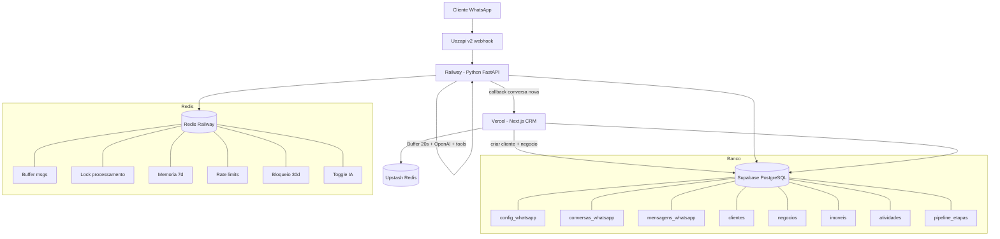
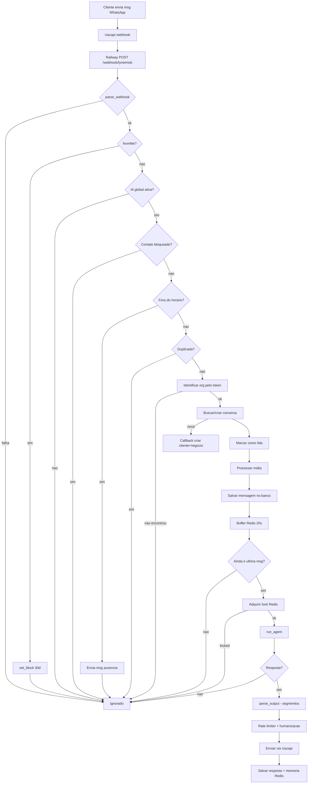
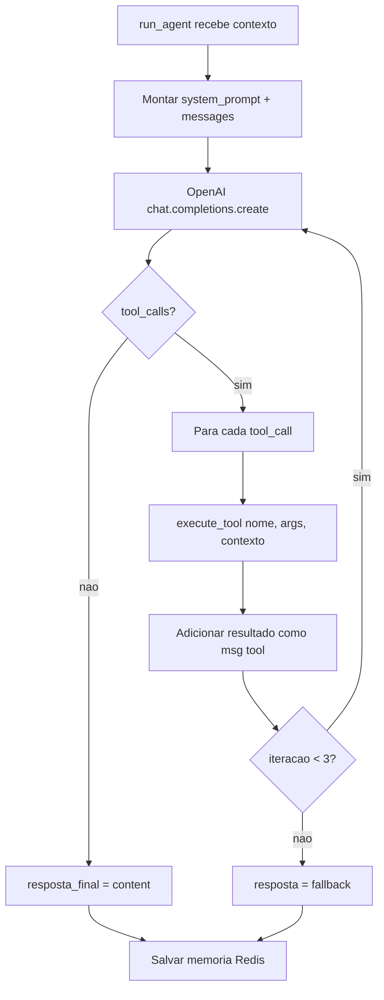
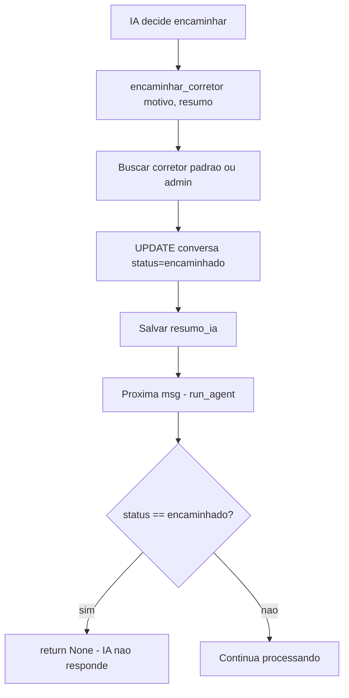

# Documentacao Tecnica — Agente IA LyneImob

Data: 16/04/2026
Autor: Gabriel Lynedesk
Task: LYNEDES-82 (subtasks 83, 84, 85, 86)

---

## 1. Visao Geral

O agente IA do LyneImob e um SDR (Sales Development Representative) automatizado que atende leads via WhatsApp 24/7. Ele qualifica clientes, apresenta imoveis, agenda visitas e encaminha pro corretor quando o lead esta pronto.

Alem do agente WhatsApp, a IA permeia todo o CRM: gera descricoes de imoveis, analisa negocios, calcula score de leads, sugere proximas acoes e produz resumos semanais automaticos.

**Numeros:**
- 30+ capacidades de IA no total
- 7 tools de function calling no agente
- 14 acoes no widget do dashboard
- 3 modelos OpenAI (gpt-4.1-mini, gpt-4o Vision, Whisper-1)

---

## 2. Stack Tecnologica

| Componente | Tecnologia | Versao |
|-----------|-----------|--------|
| LLM principal | OpenAI gpt-4.1-mini | SDK openai@^6.29.0 (JS) / openai (Python) |
| Visao | OpenAI GPT-4o Vision | — |
| Transcricao | OpenAI Whisper-1 | — |
| Agente (producao) | Python FastAPI + Uvicorn | Python 3.12 |
| Agente (codigo) | TypeScript Next.js 16 | Node.js |
| Deploy agente | Railway (Docker) | — |
| Deploy CRM | Vercel | — |
| Banco | Supabase PostgreSQL | — |
| Cache/Memoria | Redis (Railway) + Upstash | — |
| WhatsApp | Uazapi v2 | — |
| Anti-bloqueio | Rate limiter customizado | 8 msg/min contato, 60 global |

### Dependencias

**Next.js (npm):**
- `openai@^6.29.0` — SDK OpenAI
- `@upstash/redis@^1.37.0` — Redis serverless
- `@upstash/ratelimit@^2.0.8` — Rate limiting
- `@supabase/supabase-js@^2.99.1` — Banco de dados

**Python (pip):**
- `openai` — SDK OpenAI async
- `fastapi` — Web framework
- `uvicorn` — ASGI server
- `httpx` — HTTP async (Supabase REST + callbacks)
- `redis` — Redis async
- `pydantic-settings` — Config por env
- `pypdf2` — Processamento de PDF
- `python-docx` — Processamento de DOCX

---

## 3. Arquitetura



---

## 4. Fluxos

### 4.1 Fluxo Principal — Mensagem ate Resposta



### 4.2 Fluxo de Function Calling



### 4.3 Fluxo de Handoff



### 4.4 Logica de Decisao — Quando a IA NAO Responde

| Condicao | Onde verifica | Resposta |
|----------|--------------|----------|
| Mensagem propria (fromMe) | main.py:329 | `own_message` + bloqueia 30 dias |
| IA global desativada | Redis `ai:global:enabled` | `ai_globally_disabled` |
| Contato bloqueado | Redis `{chat}_timeout_{org}` | `blocked` |
| Fora do horario | config_whatsapp.horario | Envia mensagem de ausencia |
| Mensagem duplicada | mensagens_whatsapp.message_id | `duplicate` |
| Org nao encontrada | config_whatsapp por token | `org_not_found` |
| Conversa encaminhada/finalizada | conversas_whatsapp.status | return None |
| Config nao encontrada | config_whatsapp | return None |
| Sem mensagens novas | identifica_mensagens_novas | return None |

### 4.5 Montagem de Contexto do Imovel/Cliente

**Funcao:** `run_agent()` em `agent-railway/agente/core/agent.py`

**Queries executadas:**

| # | Linha | Tabela | Campos | Filtro |
|---|-------|--------|--------|--------|
| 1 | 39-44 | `config_whatsapp` | `*` | `organizacao_id + ativo=true` |
| 2 | 50-54 | `conversas_whatsapp` | `*, origem_lead, imovel_interesse_id` | `id=conversa_id` |
| 3 | 56-58 | `organizacoes` | `nome` | `id=org_id` |
| 4 | 88-92 | `mensagens_whatsapp` | `direcao, conteudo, tipo_conteudo, criado_em` | `conversa_id, order desc, limit 30` |
| 5 | 162-167 | `imoveis` | `titulo, tipo, bairro, valor, valor_aluguel` | `id=imovel_interesse_id` |

**Campos injetados no contexto_extra (linhas 100-177):**
- Nome do cliente (linha 105)
- Numero WhatsApp (linha 128)
- Status da conversa: PRIMEIRA_RESPOSTA / REATIVACAO / EM_ANDAMENTO (linha 129)
- Qualificacao existente: tipo_imovel, finalidade, bairros, faixa_preco, urgencia (linhas 131-149)
- Cliente ja criado? (linha 152)
- Negocio ja criado? (linha 154)
- Canal de origem: PORTAL / SITE / WHATSAPP (linha 157)
- Imovel de interesse: titulo, tipo, bairro, valor (linhas 159-177)

---

## 5. Atividades — Todas as Capacidades

### 5.1 Agente WhatsApp — 7 Tools

| Tool | Funcao Python | Funcao TypeScript | O que faz |
|------|--------------|-------------------|-----------|
| `buscar_imovel_por_identificacao` | `executar_buscar_imovel_por_identificacao()` tools.py:254 | `executarBuscarImovelPorIdentificacao()` executores-sdr.ts:86 | Busca imovel por ID/codigo/nome |
| `buscar_imoveis` | `executar_buscar_imoveis()` tools.py:317 | `executarBuscarImoveis()` executores-sdr.ts:167 | Lista imoveis com filtros |
| `atualizar_cliente` | `executar_atualizar_cliente()` tools.py:388 | `executarCriarCliente()` executores-sdr.ts:216 | Preenche dados do cliente |
| `atualizar_negocio` | `executar_atualizar_negocio()` tools.py:437 | `executarCriarNegocio()` executores-sdr.ts:270 | Atualiza negocio no pipeline |
| `criar_atividade` | `executar_criar_atividade()` tools.py:463 | `executarCriarAtividade()` executores-sdr.ts:348 | Agenda visita/ligacao/follow-up |
| `salvar_qualificacao` | `executar_salvar_qualificacao()` tools.py:484 | `executarSalvarQualificacao()` executores-sdr.ts:383 | Salva preferencias (merge) |
| `encaminhar_corretor` | `executar_encaminhar_corretor()` tools.py:514 | `executarEncaminharCorretor()` executores-sdr.ts:419 | Transfere pra humano |

### 5.2 Widget IA — 14 Acoes

| Modulo | Acao | Funcao | Arquivo | Linha |
|--------|------|--------|---------|-------|
| Imovel | Gerar descricao | `gerarDescricaoIA()` | `src/actions/ia-imoveis.ts` | 53 |
| Imovel | Melhorar texto | `melhorarTextoIA()` | `src/actions/ia-imoveis.ts` | 98 |
| Imovel | Gerar titulo | `gerarTituloIA()` | `src/actions/ia-imoveis.ts` | 143 |
| Cliente | Calcular score | `gerarScoreLead()` | `src/actions/ia-clientes.ts` | 82 |
| Cliente | Gerar resumo | `gerarResumoCliente()` | `src/actions/ia-clientes.ts` | 172 |
| Cliente | Match inteligente | `matchInteligente()` | `src/actions/ia-clientes.ts` | 224 |
| Negocio | Analisar contexto | `analisarNegocio()` | `src/actions/ia-negocios.ts` | 14 |
| Negocio | Sugerir acao | `sugerirAcao()` | `src/actions/ia-negocios.ts` | 124 |
| Negocio | Analisar perda | `analisarPerda()` | `src/actions/ia-negocios.ts` | 250 |
| Atividade | Gerar briefing | `gerarBriefingVisita()` | `src/actions/ia-atividades.ts` | 15 |
| Atividade | Sugerir proximo passo | `gerarSugestaoPosAtividade()` | `src/actions/ia-atividades.ts` | 148 |
| Loteamento | Gerar descricao | `gerarDescricaoLoteamentoIA()` | `src/actions/ia-loteamentos.ts` | 43 |
| Loteamento | Melhorar texto | `melhorarTextoLoteamentoIA()` | `src/actions/ia-loteamentos.ts` | 88 |
| Painel | Regenerar resumo | (via cron) | `src/lib/resumo-semanal/gerar-resumo.ts` | — |

### 5.3 Processamento de Midia

| Tipo | Funcao Python | Funcao TypeScript | Modelo |
|------|--------------|-------------------|--------|
| Audio | `transcribe_audio()` media.py:~50 | `transcreverAudio()` processar-midia.ts | Whisper-1 |
| Imagem | `analyze_image()` media.py:~90 | `analisarImagem()` processar-midia.ts | GPT-4o Vision |
| PDF/DOCX | `extract_document_text()` media.py:~140 | `extrairTextoDocumento()` processar-midia.ts | Local parsing |

### 5.4 Automaticos

| Atividade | Funcao | Arquivo |
|-----------|--------|---------|
| Resumo semanal | `gerarResumoParaOrganizacao()` | `src/lib/resumo-semanal/gerar-resumo.ts` |
| Mensagem proativa | `enviarMensagemProativaPortal()` | `src/lib/whatsapp/mensagem-proativa.ts` |

---

## 6. Pontos de Melhoria — Priorizados

### Prioridade Alta
1. Callback criar cliente/negocio depende do Vercel estar no ar — mover logica pro Python
2. Max 3 iteracoes de tools pode ser insuficiente — tornar configuravel
3. Whisper sem idioma forcado no Python — forcar `language="pt"`
4. Duas implementacoes paralelas (Python + TypeScript) — unificar no Python

### Prioridade Media
5. Memoria Redis TTL 7 dias — backup no banco pra conversas importantes
6. Sem fallback se OpenAI cair — adicionar retry com exponential backoff
7. Timezone hardcoded (-3h) — usar timezone da org
8. Vision com prompt generico — customizar por tipo de midia

### Prioridade Baixa
9. Sem streaming — implementar pra reduzir latencia percebida
10. Score de lead mistura IA + deterministico — padronizar
11. Widget oculto pra super admin — avaliar necessidade
12. Resumo semanal sem regeneracao manual — conectar botao do widget ao backend

---

## 7. Proximos Passos

### Curto prazo (proximas 2 semanas)
- Unificar: deprecar implementacao TypeScript, manter apenas Python no Railway
- Forcar `language="pt"` no Whisper
- Aumentar max_tool_iterations pra 5
- Testar cenario completo: conversa - qualificacao - busca imovel - agendamento - handoff

### Medio prazo (proximo mes)
- Implementar streaming pra respostas mais rapidas
- Adicionar fallback de modelo (gpt-4o-mini - gpt-3.5-turbo se falhar)
- Persistir memoria no banco como backup do Redis
- Dashboard de metricas da IA (tempo de resposta, taxa de qualificacao, conversao)

### Longo prazo (proximo trimestre)
- Multi-agente: agentes especializados por etapa (SDR, corretor virtual, pos-venda)
- Integracao com CRM externo (Salesforce, HubSpot)
- Analise de sentimento em tempo real
- A/B testing de prompts

---

## Variaveis de Ambiente

### Next.js (.env.example)
```
OPENAI_API_KEY=sk-proj-xxx
UPSTASH_REDIS_REST_URL=https://...
UPSTASH_REDIS_REST_TOKEN=...
SUPABASE_SERVICE_ROLE_KEY=...
AGENT_RAILWAY_URL=https://agente-xxx.up.railway.app
```

### Python (agent-railway/.env.example)
```
OPENAI_API_KEY=sk-...
OPENAI_MODEL=gpt-4.1-mini
REDIS_URL=redis://...
SUPABASE_URL=https://xxx.supabase.co
SUPABASE_SERVICE_KEY=eyJ...
NEXTJS_APP_URL=https://lyneimob.vercel.app
BUFFER_WAIT_SECONDS=20
RATE_LIMIT_PER_CONTACT_PER_MINUTE=8
RATE_LIMIT_GLOBAL_PER_MINUTE=60
```

---

## Anti-Bloqueio Meta/WhatsApp

| Mecanismo | Valor | Proposito |
|-----------|-------|-----------|
| Rate limit contato | 8 msg/min | Evitar spam por contato |
| Rate limit global | 60 msg/min | Evitar bloqueio da conta |
| Delay leitura | 0.5-2s | Simular leitura antes de digitar |
| Digitacao simulada | proporcional ao texto | Parecer humano |
| Delay entre segmentos | 1-3s (+ variacoes) | Nao enviar tudo de uma vez |
| Cooldown pos-rajada | 5s x multiplicador | Respirar apos muitas msgs |
| Gap minimo sessao | 2s | Nao enviar msgs consecutivas |
| Horario noturno | +20-60% delays | Mais lento de madrugada |

---

## Tratamento de Erros

| Componente | Erro | Comportamento |
|-----------|------|--------------|
| OpenAI | Timeout/falha | Responde: "Instabilidade, tente novamente" |
| Supabase | Insert/select falha | Log error, return None (sem resposta) |
| Redis | Conexao perdida | Health: "degraded", agente pode falhar |
| Uazapi | Envio falha | Log warning, mensagem nao chega |
| Midia | Download/transcricao falha | Mensagem generica de erro, conversa continua |
| Tools | Qualquer excecao | IA recebe texto de erro, pode contornar |
| Callback Next.js | 404/timeout | 2 retries, fire-and-forget (agente nao para) |

---

*Documento gerado por Gabriel Lynedesk — 16/04/2026*
*Referencia: LYNEDES-82 (subtasks 83, 84, 85, 86)*
